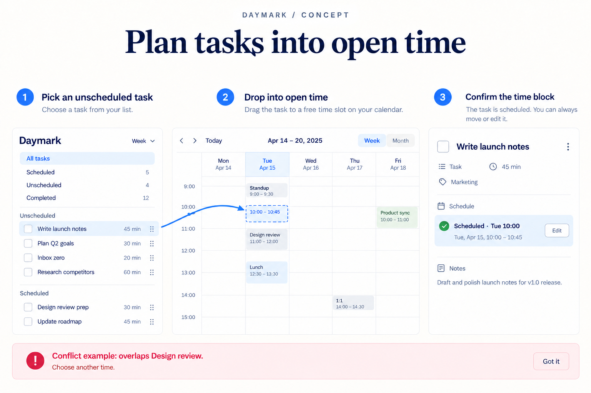

# Illustrated feature-idea examples

Explore three complete fictional briefs, each with five proposed features and a separate explanatory image per feature. These are worked documentation examples, not automatic benchmark results or screenshots of shipped software.

## App: Daymark task planner

[Read the five proposals](task-planner/README.md)

Time blocks, recurring checklists, focus sessions, dependency alerts, and weekly review. Generated UI concepts explain discovery, interaction, results, and selected failure states.

## API: Relaybox webhook delivery

[Read the five proposals](webhook-api/README.md)

Safe replay, signing-key rotation, adaptive retries, event contracts, and tenant budgets. Editable diagrams explain behavior without inventing a dashboard.

## Developer tool: Tablecraft CSV CLI

[Read the five proposals](csv-cli/README.md)

Schema validation, transform previews, saved recipes, streaming profiles, and safe quarantine. Terminal and data-flow diagrams make command-line behavior visible.

## Use these examples well

Copy the shape of the reasoning, not the feature list. Supply your own project's existing capabilities, users, and constraints. Require evidence for novelty when a repository is available, and clearly label assumptions when only a brief is available.

Each example includes acceptance criteria and proposed metrics. Those are future validation plans, not claims that the features have been built or measured. See [asset provenance](../docs/ASSETS.md) and [contribution guidance](../CONTRIBUTING.md) to add another example.
