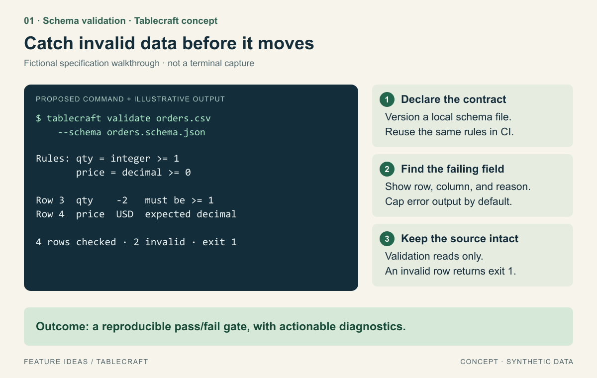
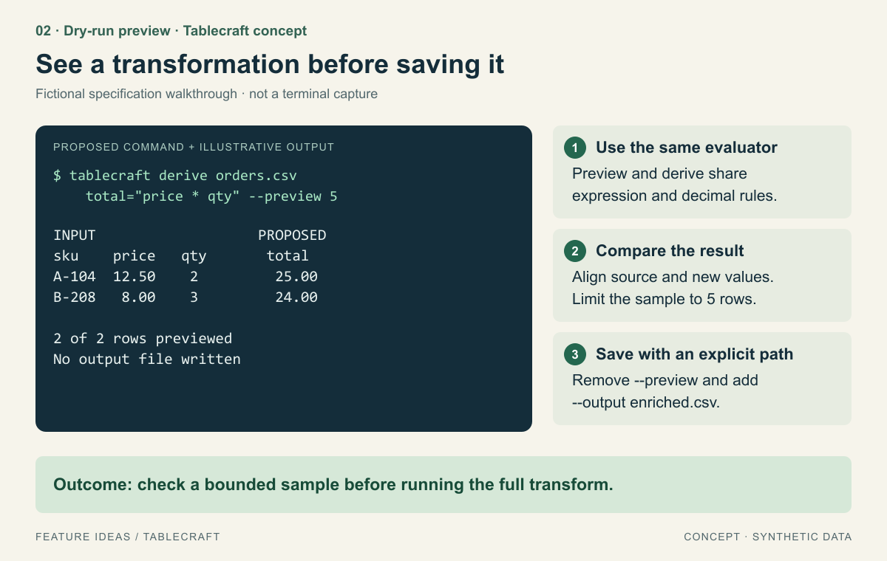
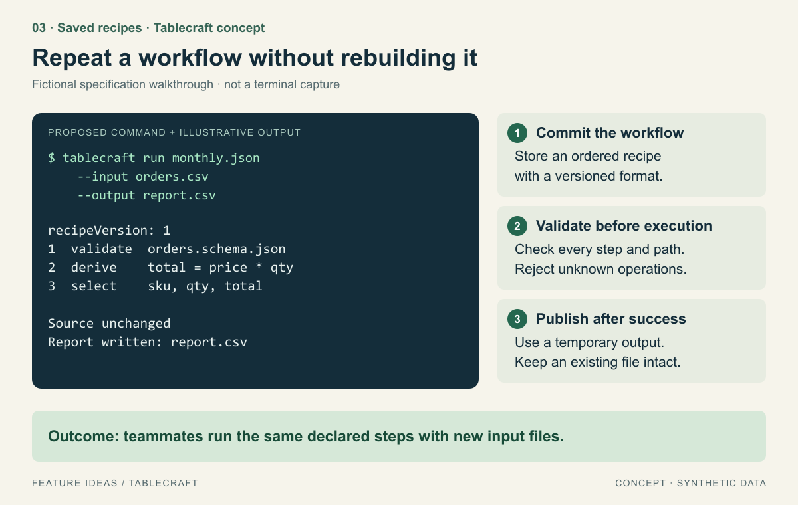
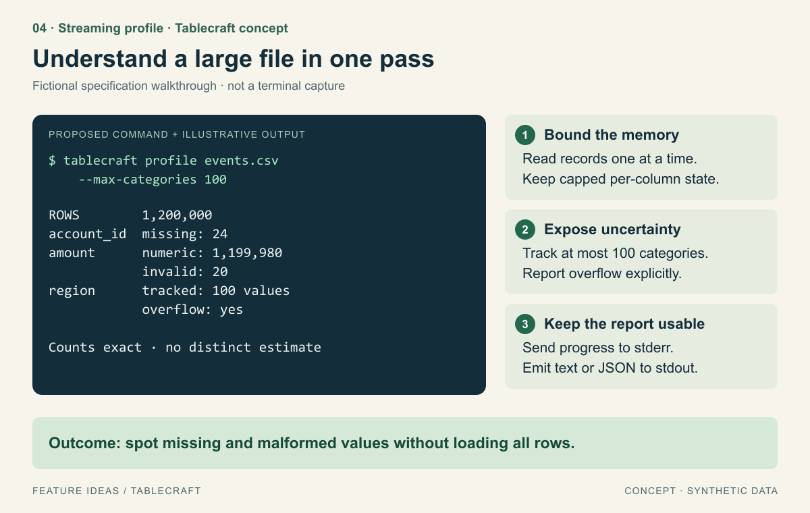
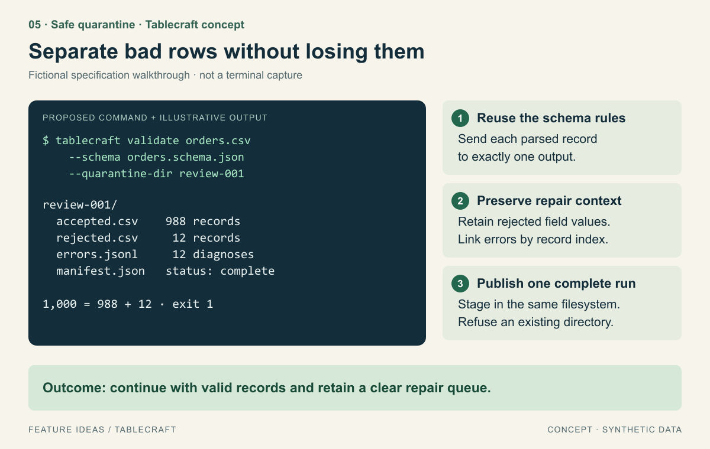

# Five illustrated feature ideas for a CSV command-line tool

This is a **fictional specification walkthrough** for **Tablecraft**, a local CSV developer CLI. No Tablecraft repository or executable was inspected or created. Commands, reports, filenames, and datasets below are synthetic concept material; the illustrations are original diagrams, not terminal captures. Success metrics are proposed evaluation criteria, not measured outcomes.

The example demonstrates how [Illustrated Feature Ideas](../../skills/feature-ideas/SKILL.md) can explain features for a project without a graphical interface. The concepts use exact, editable SVG text and rendered PNG images so their behavior is readable on GitHub.

## Exact input prompt

> Use $feature-ideas to propose exactly five new features for the fictional Tablecraft CSV CLI described below. Produce a ranked proposal with one detailed illustration per feature and actionable MVP steps. Treat this as a description-only example: do not invent repository observations or claim that any feature is implemented.
>
> Tablecraft is a local, single-process command-line tool for developers and data analysts. It already supports CSV inspection, column selection, row filtering, and deriving a column with a restricted expression evaluator. It reads UTF-8 CSV files, preserves record order, uses decimal arithmetic for numeric transformations, and writes to an explicit output path. It refuses to overwrite an existing output file. Its parser handles quoted fields and embedded newlines; errors are plain text. Current transforms load the input into memory. There is no schema validator, preview mode, recipe format, profiling command, or rejected-row export. There is no cloud service, telemetry, shell expression execution, database, or GUI.
>
> Favor local, deterministic workflows that prevent mistakes and make repeated CSV work easier. Show synthetic command examples and explain exit codes, recovery, memory costs, and useful defaults. Prioritize schema validation, preview, saved recipes, a bounded-memory profile, and safe quarantine only if they remain distinct and justified. Label every illustration Concept and distinguish expected behavior from measured results.

## Baseline, users, and selection

The baseline above is the complete evidence source. Novelty is established relative to that description, not to other CSV products. The existing parser and evaluator are assumed reusable; their implementation, speed, and extensibility remain unverified. Target users are developers and analysts who work with local exports and want understandable results in terminals and CI.

The desired journey is **inspect → check → preview → repeat**, with a clear recovery path when input is invalid. The plan is to inventory the baseline, select distinct gaps, illustrate the proposed commands and outcomes, and check each idea against an acceptance test. Acceptance of the proposal requires five separate usable ideas, five readable illustrations, concrete implementation steps, and honest limits.

| Rank | Feature | User benefit | Value / confidence in fit | Effort | Key dependency |
|---|---|---|---|---|---|
| 1 | Schema validation | Stop malformed data before downstream work | High / Medium | Medium | Parser location reporting |
| 2 | Transformation preview | Inspect computed values before writing | High / Medium | Small–Medium | Existing expression evaluator |
| 3 | Saved recipes | Repeat declared steps consistently | High / Medium | Medium | Versioned operation registry; validation |
| 4 | Streaming profile | Understand larger inputs without loading them all | Medium / Medium | Medium | Incremental parser interface |
| 5 | Safe quarantine | Isolate invalid records while retaining repair context | Medium / Medium | Medium–Large | Schema validation; transactional directory publication |

All effort estimates are relative hypotheses. Validation ranks first because it supports CI, recipes, and quarantine. Preview is a separate low-friction way to prevent semantic mistakes; validation cannot tell whether a valid calculation expresses the user's intent. Profiling summarizes a file without deciding whether its records meet a contract. Quarantine changes how validation results are retained, rather than adding another checker. A cloud dashboard and AI-generated transformations were excluded because they add infrastructure and uncertainty without serving this local workflow.

## 01. Schema validation

Developers need a shareable contract for files that look parseable but contain unsuitable values. Add `tablecraft validate INPUT --schema FILE` with a small versioned JSON schema format for required columns, text, integer, decimal, null handling, and numeric bounds. This capability is absent from the stated baseline.

*The contract and diagnostics connect the declared rules to the exact field that needs repair. [Editable SVG](images/01-schema-validation.svg).*

**Experience.** The user writes a local schema, runs validation, and sees record index, column name, rejected value, and reason. Record indexes refer to logical CSV records after the header, not physical lines; quoted multiline fields can span several lines. Default output shows the first 20 errors, then a total. `--format json` supplies stable machine-readable diagnostics. Exit `0` means valid, `1` means invalid data, and `2` means command, schema, or I/O failure. No input changes occur. A header-only file reports zero records clearly; whether it is valid follows an explicit schema `minRecords` rule.

**MVP implementation plan** *(integration points are hypothetical)*:

1. Define a versioned schema and the rules for missing columns, empty values, decimal conversion, and duplicate headers; reject ambiguous headers.
2. Add a validator over parsed records with logical record indexes and stable error codes, reusing the CSV parser.
3. Add text and JSON reporters, a diagnostic display cap, and the documented exit-code contract; keep total counters independent of the display cap.
4. Add command help and synthetic fixtures for passing data, invalid values, invalid schemas, and quoted multiline fields.

**Validation.** Acceptance: a four-record fixture with `qty=-2` in record 3 and `price=USD` in record 4 yields exactly two field errors, exit `1`, and byte-identical input. Edge case: a malformed schema yields exit `2` before scanning the CSV, rather than labeling every record invalid. Proposed user metric: in a task study, users can locate and correct both fields from the report without opening documentation; record completion and misinterpretations, with no success-rate claim yet.

**Tradeoffs.** A small schema is easier to understand but less expressive than a general contract language. Avoid cross-record uniqueness in the MVP because exact checking can require unbounded state. Scanning remains at least linear in input size. Default diagnostics may reveal sensitive field values in terminal logs; offer value redaction and explain that JSON output follows the same setting.

## 02. Transformation preview

Analysts can currently derive columns, but cannot see proposed output before writing. Add a bounded `--preview N` mode to `derive` that uses the same evaluator and formatting rules as the real command.

*The visible comparison helps catch a valid but unintended formula. [Editable SVG](images/02-transform-preview.svg).*

**Experience.** `tablecraft derive orders.csv total="price * qty" --preview 5` shows up to the first five logical records and their proposed result. The command states the sample limit and that no output was written. To save, the user removes `--preview` and supplies `--output enriched.csv`; an existing file is still protected. A preview only validates evaluated sample records. Later errors remain possible during a full run, and the footer says so whenever the end of input has not been reached. Empty input shows “0 records to preview”; malformed sampled expressions point to the expression and preserve the file.

**MVP implementation plan**:

1. Extract or confirm a shared per-record evaluator so preview and full transforms use identical decimal arithmetic and null behavior.
2. Add a positive bounded sample parameter, defaulting to 5 when `--preview` has no value; reject conflicting output-writing flags.
3. Render aligned before/proposed columns with truncation markers for long values and a `--format json` alternative that preserves full values.
4. Add a safe first-record sampling path; if the parser cannot stop early, disclose the full-input memory cost until that path exists.

**Validation.** Acceptance: `12.50 × 2` and `8.00 × 3` render as `25.00` and `24.00`, match full-transform results under the same decimal formatting policy, and create no output file. Edge case: an invalid numeric value after sample record 5 does not appear as “all records valid”; the preview is visibly sample-only. Proposed user metric: users identify an intentionally wrong multiplier before saving and understand that unsampled records were not checked.

**Tradeoffs.** First-record sampling is deterministic and cheap but may miss rare values. Random sampling, distribution-aware sampling, and interactive editing are deferred. Narrow terminals need stacked record output or JSON instead of unreadable horizontal tables. The shell-specific quoting in help must be tested on supported platforms.

## 03. Saved recipes

Repeated monthly processing currently requires users to reconstruct commands. Add a versioned declarative recipe containing an ordered list of supported operations, with input and output supplied at run time.

*The recipe is a reviewable sequence of built-in operations, not a shell script. [Editable SVG](images/03-saved-recipes.svg).*

**Experience.** `tablecraft run monthly.json --input orders.csv --output report.csv` preflights the whole recipe and shows a concise stage summary. Recipe version 1 supports only `validate`, `select`, `filter`, and `derive`. Relative schema paths resolve against the recipe directory; run input/output paths resolve against the current working directory, and help explains this distinction. Invalid data stops the pipeline with exit `1`; malformed recipes or inaccessible paths use exit `2`. Failure reports the stage and removes staged output. Existing destination files are never replaced.

**MVP implementation plan**:

1. Define a versioned recipe schema with an allowlist of operations and explicit parameters; forbid shell commands, network fetches, and dynamic code.
2. Add a preflight pass for operation names, types, schema paths, and output conflicts before touching output state.
3. Build a sequential runner using existing command primitives plus the new validator; keep the current in-memory transform behavior explicit.
4. Write into a temporary file on the destination filesystem and publish with a no-replace operation only after every stage succeeds; document unsupported filesystem behavior.

**Validation.** Acceptance: two runs using the same input, recipe, tool version, and output formatting options produce byte-identical output at two unused paths. Edge case: a failure in stage 3 publishes no final file and leaves the source untouched; an output-path collision also preserves the existing file. Proposed user metric: a teammate can run the supplied recipe on a second monthly file without manually reconstructing any step.

**Tradeoffs.** Versioning and migration add maintenance. Reproducibility requires pinning the tool version; recipes alone cannot guarantee identical behavior across arbitrary releases. Sequential in-memory operations retain the baseline's large-file limit; fusion and streaming transforms are deferred. Reusing commands reduces divergence but may first require separating CLI parsing from the transformation core.

## 04. Streaming data profile

Users need a quick picture of a large export before deciding on a schema or transform. Add `profile` with one-pass row counts, missing-value counts, numeric parse counts, min/max for successfully parsed numeric values, and bounded categorical tracking.

*Illustrative counts show the proposed report shape; they are not a benchmark. [Editable SVG](images/04-streaming-profile.svg).*

**Experience.** `tablecraft profile events.csv --max-categories 100` prints a concise report after processing; periodic progress goes to stderr only on an interactive terminal. JSON output remains clean on stdout. Category tracking retains the first 100 distinct values and counts subsequent occurrences of those values; when another value appears, it reports overflow. It does not label the result as an exact distinct count or a “top 100” ranking. Canceling yields no complete report and an interrupted status. Missing values follow documented CSV conventions instead of silently guessing that a literal `NA` is null.

**MVP implementation plan**:

1. Establish an incremental parser interface that correctly handles quoted delimiters, embedded newlines, and chunk boundaries.
2. Implement per-column counters and bounded category maps; define maximum columns and field size so memory claims have explicit limits.
3. Add text/JSON reporting with missingness rules, category overflow, and inferred numeric compatibility labeled as observations rather than guaranteed types.
4. Add stderr progress, cancellation cleanup, and a benchmark fixture generator for comparable memory measurements.

**Validation.** Acceptance: fixtures containing known missing, numeric, and invalid values produce exact counters; a column with 101 categories and cap 100 explicitly reports overflow. Edge case: a single oversized quoted field fails with a field-size diagnostic instead of invalidating the memory bound. Proposed metric: compare peak resident memory at 10,000 and 1,000,000 records with identical widths and category caps; the target is bounded growth in aggregation state, and actual process overhead must be measured separately. User success means identifying the column needing cleanup from the report.

**Tradeoffs.** A single pass still costs linear I/O time. Bounded category storage cannot provide an exact distinct count after overflow, and this MVP deliberately avoids opaque approximations. Memory is bounded by column limits, category limits, and field-size limits rather than by row count. Profiling does not make the existing transformation commands stream automatically.

## 05. Safe quarantine for invalid records

Validation identifies bad data but offers no repair artifact. Extend it with `--quarantine-dir NEW_DIRECTORY`, placing accepted records, rejected records, diagnostics, and a completion manifest into a single new output directory.

*The record-count invariant and completion manifest make the split auditable. [Editable SVG](images/05-safe-quarantine.svg).*

**Experience.** The user runs validation with a schema and a new directory name. Accepted and rejected CSVs preserve the original columns, field values, and ordering within each partition. Re-serialization may change quoting or line endings; byte preservation is not promised. `errors.jsonl` links each rejected record's original logical index to one or more errors. A rejected record appears once even if several fields fail. The manifest records schema content hash, counts, tool version, and completion status. Invalid data still returns exit `1`, with a message confirming that the quarantine artifact was produced successfully.

**MVP implementation plan**:

1. Reuse schema-validation decisions and create an exact partition: every successfully parsed source record reaches one and only one CSV output.
2. Stream both partitions and diagnostics into a fresh sibling staging directory on the same filesystem; preserve original record indexes in diagnostics.
3. Write a manifest only after output streams close successfully, then publish the directory with a no-replace rename where supported.
4. Handle I/O failure and cancellation by removing only task-created staging files; reject unsupported publication semantics and pre-existing destinations with clear recovery instructions.

**Validation.** Acceptance: a fixture with 1,000 parsed records and 12 invalid records yields 988 accepted plus 12 rejected, with every rejection linked to diagnostics and an unchanged source file. Edge case: an unterminated quoted field makes record boundaries uncertain; abort without publishing a complete directory rather than guessing which rows to quarantine. Proposed user metric: users can repair one rejected record from the CSV plus its linked diagnostic and resubmit it without losing the original row's context.

**Tradeoffs.** This is more complex than a single output file and requires storage for the partitions and diagnostics. A staging directory improves all-or-nothing publication, but crash durability depends on platform and filesystem guarantees and is not promised in the MVP. Spreadsheets may interpret formula-like field values when opening CSVs; preserve raw data here and document that CSV outputs are data files, rather than silently rewriting values.

## CLI experience across all five features

Discoverability comes from command-specific `--help`, short examples, and a common exit-code table. Defaults are read-only or require unused explicit destinations. Plain-text output carries meaning without color; `NO_COLOR` and noninteractive execution must be supported. Progress belongs on stderr, stable JSON belongs on stdout, and errors include a next action. Narrow terminals use wrapped labels or stacked records, with no required mouse interaction. Empty files, missing headers, invalid parameters, inaccessible paths, cancellation, and destination conflicts need distinct feedback. These are acceptance expectations for a future implementation, not properties verified in a running app.

## Recommendation and verification status

Build schema validation and preview first, then recipes. Profile can proceed independently once incremental parsing is available. Quarantine should follow proven validator semantics and filesystem publication behavior. This sequence gives users early mistake prevention while keeping later features grounded in shared, tested primitives.

The key tradeoff is between a small predictable local tool and richer data-processing machinery. Keep the initial schema and recipe languages narrow, make memory limits visible, and preserve original files. The main uncertainties are parser reuse, filesystem support, and whether real users prioritize repeatability over large-file profiling; validate those before expanding scope.

This folder contains a static proposal with five original diagrams. The CLI features, behavioral tests, user studies, and performance measurements have **not** been implemented or executed. Regenerate the editable illustrations with `node generate-illustrations.cjs`; to also render PNGs, install `sharp` in a temporary working directory, expose it through Node's module resolution, and run `node generate-illustrations.cjs --png`. No network access or paid image generator is needed once that renderer is available.
