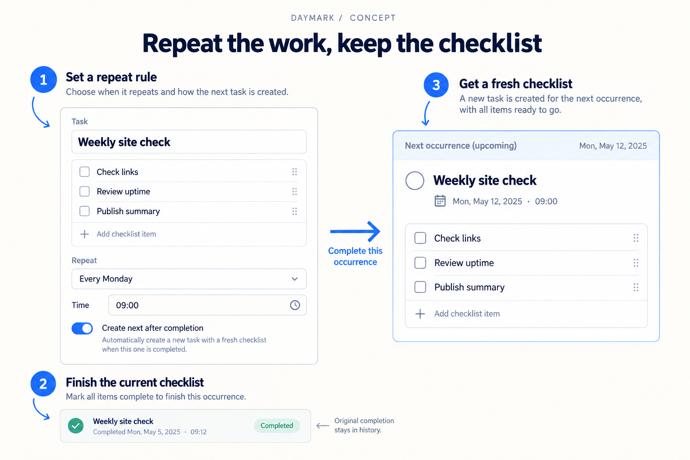
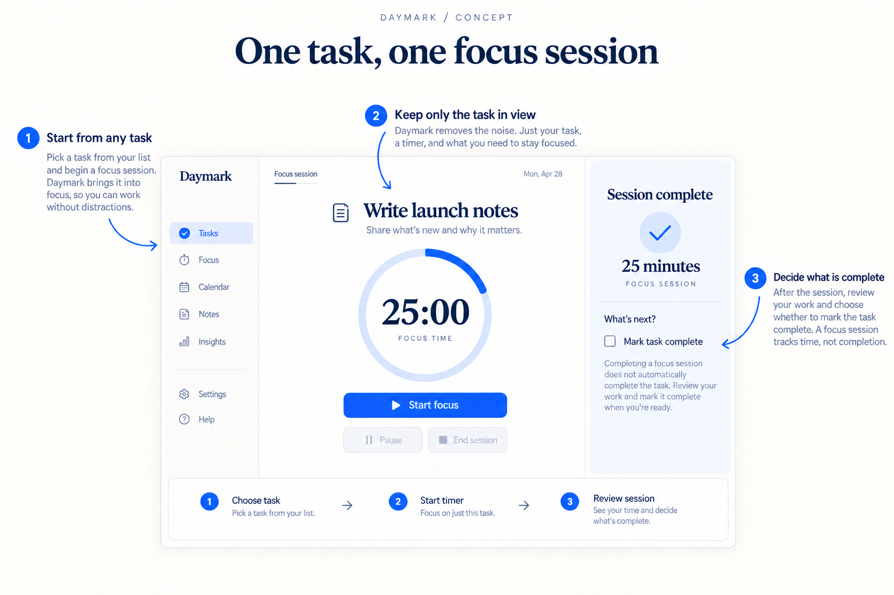
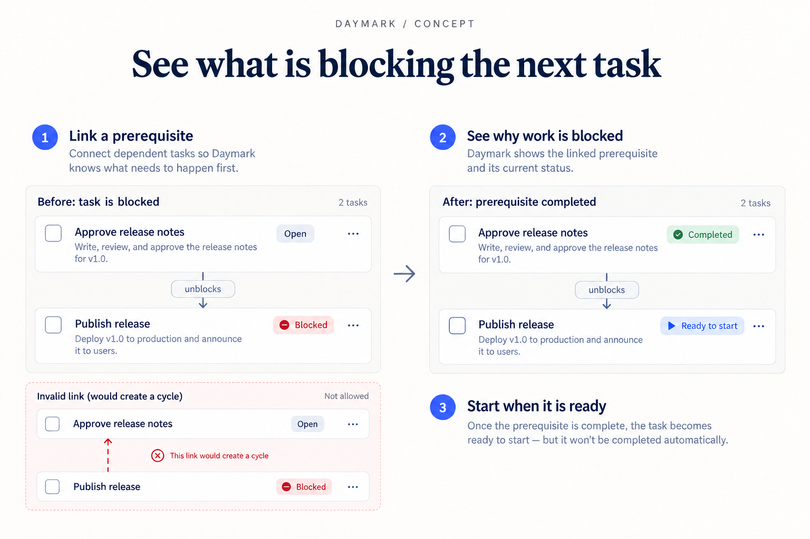
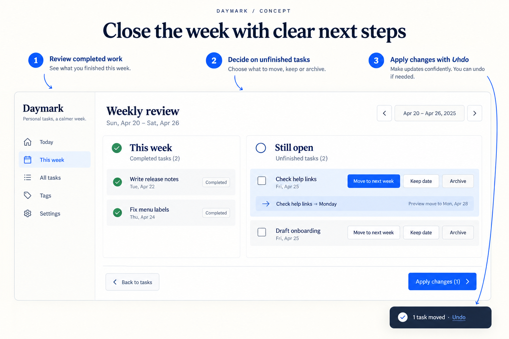

# Daymark: five features for a personal task planner

This is a **fictional project brief and worked proposal**. Daymark is not a shipped app in this repository. The illustrations are generated concept images, and the tests below describe behavior to validate if someone implements the ideas. No usability or performance results are claimed.

[Back to gallery](../README.md) · [Read the skill](../../skills/feature-ideas/SKILL.md)

## Supplied baseline

Daymark helps an individual manage personal project work. It supports tasks, checklists, due dates, tags, manual completion, a read-only weekly calendar, and completion history. It does not support time blocks, recurring tasks, focus sessions, dependencies, or guided weekly reviews. All data is local; collaboration and external calendar sync are outside the brief.

The desired experience is a calm daily planning loop: choose work, make time for it, execute, and reconsider unfinished tasks. A small implementation team must preserve keyboard access and make the whole journey usable on a phone. There is no codebase to inspect, so all component names and estimates below are conceptual integration points.

## Exact input prompt

```text
Use $feature-ideas for Daymark, a fictional personal task planner.
Existing features: tasks, checklists, due dates, tags, manual completion,
a read-only weekly calendar, and completion history. All data is local.
Propose 5 useful new features with a detailed UI concept image for each.
Prioritize an individual's planning loop. Do not assume collaboration,
cloud sync, a real repository, or an existing design system. Include ranked
value and effort, MVP steps, tests, failure cases, and proposed metrics.
```

## Ranked shortlist

| Rank | Feature | Value | Effort | Dependency |
| --- | --- | --- | --- | --- |
| 1 | Time blocks | High: turns a task list into a feasible daily plan | Medium | Editable calendar and local time handling |
| 2 | Recurring checklists | High: reduces repeated setup | Medium | Stable occurrence IDs and completion history |
| 3 | Weekly review | Medium: makes unfinished work an explicit decision | Small | Date updates, batch action history |
| 4 | Focus sessions | Medium: supports execution after planning | Small | Persisted session timestamps |
| 5 | Dependency alerts | Medium: helps sequence larger personal projects | Medium | Task-link graph and cycle validation |

These are relative judgments against the supplied brief, not market evidence. Image numbers follow the feature IDs below; build priority is given in the table.

## 01 — Time blocks


*The calendar shows the action; the task detail shows the result. The conflict banner is an alternative error example. Scheduling does not mark a task complete.*

**Need and experience.** A due date says when work is needed, but not when the user will do it. From a task's **Schedule** action, choose duration and an open slot, preview, and confirm. Drag-and-drop is an optional shortcut. On narrow screens, use a labeled date/time form instead of a compressed calendar.

**MVP plan.**

1. Add start time and duration to a separate time-block record linked to a task; preserve the existing due date.
2. Add a keyboard-accessible Schedule form and editable calendar slot with a preview.
3. Detect overlap with existing blocks before save and offer a different time without losing the input.
4. Persist changes locally and provide an Undo action; keep task completion independent.

**Acceptance test:** Schedule a 45-minute task at 10:00; reload; verify a 10:00–10:45 block and an incomplete task. Move it using only the keyboard and undo the change.

**Edge case:** Crossing a daylight-saving transition must preserve the user's intended local time or explicitly explain an invalid time. A deleted task must not leave an orphan calendar block.

**Proposed metric:** Median time to schedule three tasks in a moderated task study, plus overlap errors and keyboard completion rate. Establish a baseline before choosing a target.

**Tradeoffs:** Calendar editing adds complexity and needs timezone decisions. Index blocks by date rather than scanning every task on each pointer movement. The MVP avoids external calendars and automatic scheduling.

## 02 — Recurring checklists



*A repeat rule creates a new occurrence; it does not reset the historical one.*

**Need and experience.** Repeated work should not require reconstructing a checklist. In task details, **Repeat** reveals a plain-language schedule and next-occurrence preview. Start with weekly recurrence. Completing an occurrence creates the next upcoming Monday task, with all items unchecked. Missed weeks do not generate a backlog by default.

**MVP plan.**

1. Separate a recurring template from dated task occurrences.
2. Add weekly rule selection, local time, and a preview of the next date.
3. Create the next occurrence idempotently when the current one completes, retaining the old completion record.
4. Offer **Stop repeating** and make edits explicitly apply to future occurrences.

**Acceptance test:** Complete Monday's site-check task twice through a retried action; exactly one next occurrence exists with three unchecked items, while the original stays completed.

**Edge case:** Completing an overdue occurrence three weeks later should produce the next future Monday, not three unexpected tasks. Undoing completion must handle an already-created next occurrence without deleting later edits.

**Proposed metric:** Time spent recreating routine checklists, and duplicate occurrence rate in test logs. Compare against manual duplication.

**Tradeoffs:** Predictable weekly recurrence is easier to explain than a comprehensive calendar rule editor. Stable identifiers and transactional local writes matter more than background scheduling infrastructure.

## 03 — Focus sessions



*The illustration juxtaposes the initial timer and the later session review. Session completion and task completion are separate events.*

**Need and experience.** Once work is selected, the user can enter **Focus** from the task action menu. The initial state offers Start; Pause and End become active only after starting. Ending a session presents duration and an optional, unchecked **Mark task complete** control. Audio is opt-in, and motion is unnecessary.

**MVP plan.**

1. Store session start time, accumulated pause duration, and associated task ID.
2. Build a single-task focus view with visible controls and keyboard operation.
3. Calculate elapsed time from timestamps so background-tab throttling does not corrupt duration.
4. Persist the session and show a review step without automatically completing the task.

**Acceptance test:** Start, pause for two minutes, resume, and reload. The duration excludes the pause; finishing the session leaves the task incomplete unless the user explicitly checks it.

**Edge case:** A device sleep or wall-clock adjustment must not cause negative duration or silently imply uninterrupted work. Offer a correction when restored session timing is uncertain.

**Proposed metric:** Fraction of study participants who can start, pause, and end a session unaided; unintended task-completion count.

**Tradeoffs:** Timer accuracy and recovery deserve more effort than animated progress. Avoid per-second screen-reader announcements; announce meaningful state changes and expose remaining time on demand.

## 04 — Dependency alerts



*Readiness changes after a prerequisite is completed; the dependent task is still open.*

**Need and experience.** A task can appear actionable even when another task must happen first. Add **Depends on** in task details. A **Blocked** label names the prerequisite and links to it. Completing that prerequisite changes the dependent task to **Ready to start**. The list view exposes the relationship in text, not color alone.

**MVP plan.**

1. Store directed prerequisite links and reject self-links and cycles before saving.
2. Add a searchable task picker with a plain-language description of the relationship.
3. Derive readiness from current prerequisite states; update affected tasks after completion or reopening.
4. Handle deletion by showing the affected links and allowing the user to remove them intentionally.

**Acceptance test:** Link Publish release to Approve release notes. Verify blocked state; complete the prerequisite; verify ready state with no automatic completion. Reopen the prerequisite and verify blocked state returns.

**Edge case:** Reject a cycle spanning three tasks, not only a direct reverse link. Show the problematic relationship so the user can resolve it.

**Proposed metric:** Errors in choosing the next actionable task in a multi-step project exercise, compared with the original flat list.

**Tradeoffs:** Graph traversal grows with the task graph; scope validation to relevant links and test realistic sizes. Dependencies may burden small lists, so hide configuration until requested and avoid mandatory setup.

## 05 — Weekly review



*The review connects each decision to the affected task. The confirmation shown is the state after applying the previewed change.*

**Need and experience.** Unfinished tasks should not silently accumulate. **Review week** opens completed work and open tasks for the selected week. Each open task offers **Move to next week**, **Keep date**, or **Archive**. No action is preselected. Users preview changes and apply them together; Undo restores the previous state.

**MVP plan.**

1. Query completed and unfinished tasks for an explicit local week boundary.
2. Add per-task decisions and a preview showing the resulting dates or archive state.
3. Commit the chosen changes atomically with an undo record.
4. Provide a readable empty state and a stacked mobile layout; preserve choices if a save fails.

**Acceptance test:** Move one task, keep another, and archive a third. Apply once, verify only those changes, then undo and verify all original values return.

**Edge case:** If a task changes after the review opens, show the conflict and preserve the user's other choices rather than overwriting the newer task silently.

**Proposed metric:** Time to resolve a fixed set of unfinished tasks and the rate of accidental rescheduling during user testing.

**Tradeoffs:** A single local transaction keeps batch operations understandable. Avoid gamified productivity scores: completion counts do not establish the quality of work or personal productivity.

## Recommendation and uncertainty

Build time blocks first if observation confirms users struggle to allocate time. Build recurring checklists first if repeated setup is the stronger need. Both improve existing workflows without assuming a new collaboration product. Weekly review is a smaller follow-on; focus sessions and dependencies should follow demonstrated demand.

The most important unknowns are real user behavior, the local storage model, time semantics, and the existing UI conventions. Images explain proposed behavior; they are not an interaction prototype or a tested design system. Production interfaces need semantic live controls, responsive layouts, and keyboard and screen-reader testing.
