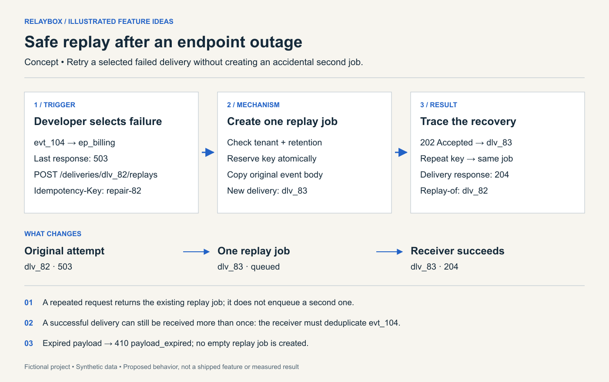
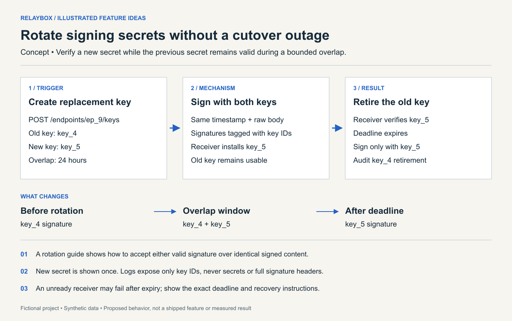
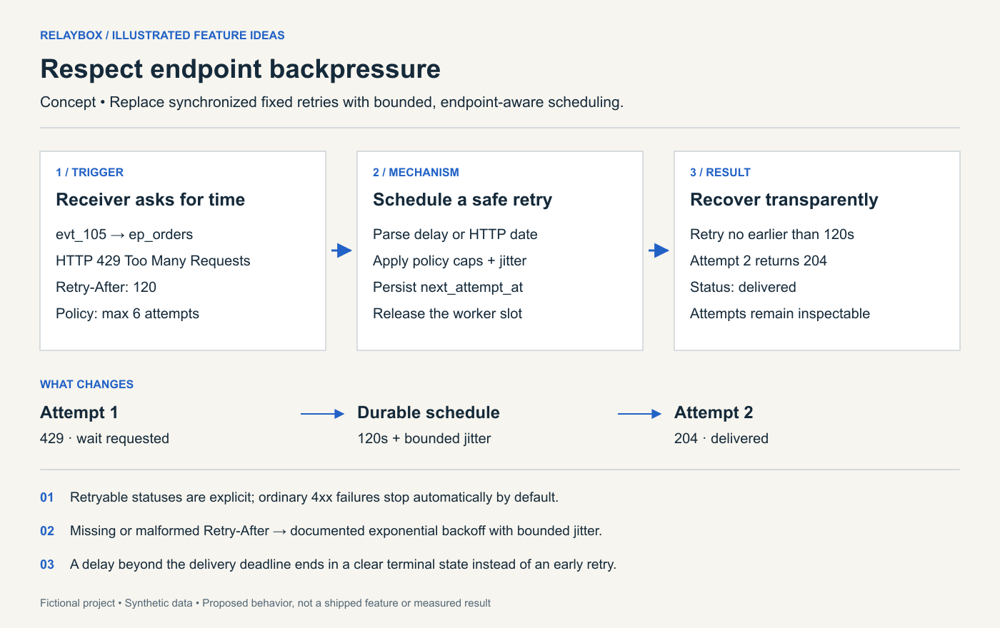
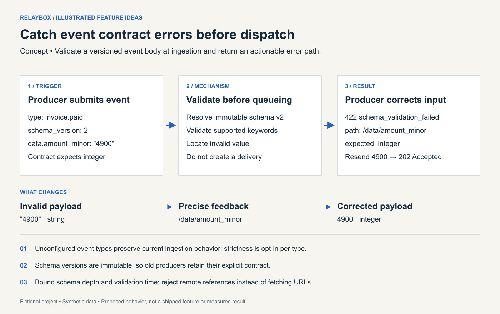
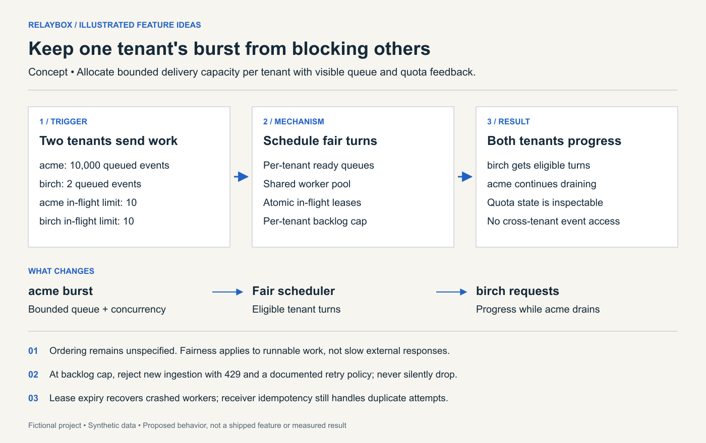

# Relaybox: five illustrated feature ideas for a webhook API

A complete **fictional worked example** of the Illustrated Feature Ideas skill. It shows how to explain backend features with concrete data-flow diagrams when there is no app screen to mock up. Relaybox is a made-up reference project, not an inspected repository or a claim about a real product.

All features, endpoints, schemas, numbers, and diagrams below are proposed examples. No features were implemented, no users were interviewed, and no impact measurements were collected. Tests and metrics describe future validation.

## Reference brief and exact input

**Baseline supplied to the skill:** Relaybox serves developers integrating a multi-tenant SaaS product with customer systems. It accepts JSON events at `POST /events`, records an event ID, and queues HTTP deliveries to registered HTTPS endpoints. It signs each delivery using one secret per endpoint and makes three fixed retries after failures. Developers can retrieve delivery state and attempt history. Payloads are retained for seven days. Tenant-scoped authorization already exists. Delivery can happen more than once; ordering is unspecified. There is no replay API, overlapping key rotation, adaptive retry policy, event schema registry, or per-tenant delivery capacity allocation. There is no dashboard.

**Constraints and intended outcome:** A small engineering team wants incremental improvements to recovery, integration reliability, and developer feedback. Preserve existing clients by default. Use API documentation, predictable response bodies, and inspectable delivery state instead of adding a dashboard. Queue, database, and signing implementations are unspecified; all component integration points below are provisional.

**Exact prompt:**

```text
Use $feature-ideas to propose exactly 5 new features for Relaybox, a fictional
multi-tenant webhook delivery API. Its developer users submit JSON to POST
/events; Relaybox queues HTTPS deliveries, signs each with one endpoint secret,
and makes three fixed retries. Delivery state and attempt history are readable.
Payload retention is seven days. Tenant authorization already exists. Delivery
may happen more than once and ordering is unspecified. There is no replay API,
overlapping key rotation, adaptive retry policy, schema registry, per-tenant
delivery capacity allocation, or dashboard.

Assume a small team and prioritize recovery, reliability, and clear developer
feedback. Preserve existing clients by default. Work only from this reference
brief; do not claim to inspect code or a running product. Rank the ideas, create
one detailed native diagram with concrete synthetic data per feature, and give
each idea an MVP plan, acceptance test, edge case, success metric, and tradeoff.
Use proposed metrics, not invented measurements. Do not implement the features.
```

**Approach:** Inventory the supplied baseline, compare distinct user outcomes, illustrate each retained feature, and review novelty, implementation boundaries, and validation. The acceptance criteria for this proposal are five non-duplicated ideas, five legible illustrations, and an actionable MVP and meaningful test for each idea.

## Ranked shortlist

Value and effort are qualitative estimates against this brief. Fit is provisional because there is no production evidence. “New” means absent from this fictional baseline.

| Rank / ID | Feature | User benefit | Value | Effort | Key dependency |
| --- | --- | --- | --- | --- | --- |
| 1 / 01 | Safe replay | Recover a selected delivery after fixing an outage | High | Medium | Retained payloads, atomic job creation |
| 2 / 02 | Signing-key rotation | Replace a secret without a single cutover instant | High | Medium | Versioned secret storage, receiver compatibility |
| 3 / 03 | Adaptive retries | Respect a receiver's temporary overload | High | Medium | Durable delayed scheduling |
| 4 / 04 | Event contracts | Find payload mistakes before they reach receivers | Medium | Medium | Bounded validator, versioned schema storage |
| 5 / 05 | Tenant budgets | Preserve progress during another tenant's burst | High at scale | Large | Queue partitioning, distributed concurrency control |

Replay ranks first because it adds a direct recovery action to the existing delivery history. Key rotation addresses a bounded operational task. Adaptive retries extend the existing retry system. Contracts add a new producer workflow; tenant budgets touch the scheduler most broadly and need workload evidence before committing to the larger effort.

## 01 — Safe replay after an endpoint outage

**Need and novelty:** An integration developer has fixed a receiver that returned `503` but cannot resubmit the original producer event. Add a replay operation for one retained delivery, with a new delivery ID linked to the original. This extends existing history into recovery.



*The replay request creates one job for repeated uses of the same key. It does not promise exactly-once processing at the receiver.* [Editable SVG](images/01-safe-replay.svg)

**Experience:** From the delivery-history API reference, copy the replay example. Submit `POST /deliveries/dlv_82/replays` with `Idempotency-Key: repair-82`. The response is `202` with `dlv_83` and a status URL. A repeated identical request returns that same replay resource. Pending, delivered, and failed states are explicit; an empty replay history returns an empty list. The original event ID and payload remain stable so the receiver can deduplicate.

**MVP plan:**

1. Add a tenant-scoped replay resource and `replay_of` relation to the delivery model; retain the source event ID and immutable payload reference.
2. Validate access, replay eligibility, and payload retention before atomically reserving the idempotency key and creating the job. Reusing a key with a different request returns `409`.
3. Enqueue via the existing worker path, preserving destination and event content while generating a fresh signature timestamp for each attempt. Make database-to-queue publication recoverable.
4. Extend history and API documentation with replay status, retention errors, duplicate-receipt guidance, and a copyable recovery example. Defer bulk replay and payload editing.

**Validation:** Send two concurrent identical replay requests and assert they resolve to one job and one replay resource. Complete that job against a fixture receiver and assert history records the original relation and the successful attempt. **Edge case:** A payload outside seven-day retention returns `410 payload_expired` without a queued job; a delivery from another tenant remains inaccessible. **Proposed metric:** Time from a developer identifying a recoverable failure to confirming replay success, measured separately from receiver downtime; track accidental duplicate replay jobs as a correctness invariant with a target of zero.

**Tradeoffs:** Idempotency and durable publication add persistence logic. Replays consume normal delivery capacity and may repeat downstream side effects, so the documentation must distinguish job deduplication from receiver deduplication. Medium effort assumes the current queue can reuse an immutable retained payload.

## 02 — Rotate signing secrets without a cutover outage

**Need and novelty:** An operator needs to replace an endpoint secret while different receiver instances deploy at different times. Add two valid signatures during a bounded rotation window; the baseline supports only one secret.



*The overlap makes a staged receiver rollout possible. The expiry deadline remains a real operational boundary.* [Editable SVG](images/02-signing-key-rotation.svg)

**Experience:** Request a replacement through `POST /endpoints/ep_9/keys`. Return the new secret once, its key ID, and an exact overlap deadline. During the proposed 24-hour default window, the receiver accepts either valid signature over the timestamp and original body bytes. A receiver verification example is part of the rotation guide. Status lists key IDs and active/retiring states without exposing secrets. The API cannot infer which key a receiver verified merely from a `2xx` response; readiness is an operator check.

**MVP plan:**

1. Extend endpoint secret storage with key IDs, activation times, retirement times, and at most two active keys; use the existing secret-protection boundary.
2. Define a compatible dual-signature format. Preserve the legacy signature during overlap and prove that existing receivers ignore or tolerate the additional metadata before rollout.
3. Update signing and verification examples to cover raw-body integrity, timestamp freshness, key lookup, and acceptance of either valid signature during the overlap.
4. Add rotation status and audit records, automatic retirement, and explicit emergency revocation. Defer automated receiver readiness detection.

**Validation:** Exercise a receiver that knows only `key_4`, one that knows both keys, and one that knows only `key_5` during overlap; each must verify its available valid signature. After expiry, new requests carry no `key_4` signature. **Edge case:** A second rotation during overlap returns a clear conflict instead of silently retiring an in-use key; never log secret values. **Proposed metric:** Rotation completion without authentication-related delivery failures, measured in an instrumented pilot; separately count leaked secrets in captured logs, with a correctness target of zero.

**Tradeoffs:** Two signatures temporarily increase signing work and header size. Receiver format compatibility is the main uncertainty and a release gate. An overlap cannot guarantee continuity if nobody deploys the replacement before the deadline; the API must expose that deadline clearly and document recovery.

## 03 — Respect endpoint backpressure

**Need and novelty:** Fixed retries can repeat a request while a receiver is explicitly overloaded. Add an opt-in endpoint retry policy that recognizes backpressure, uses bounded backoff and jitter, and exposes its next scheduled attempt. The added value is timing and policy control, beyond the baseline's three fixed retries.



*The waiting period lives in durable scheduling state. A worker does not sleep while holding capacity.* [Editable SVG](images/03-adaptive-retries.svg)

**Experience:** Enable an endpoint policy through the API; existing endpoints retain current behavior until opted in. A `429` with `Retry-After: 120` produces a visible `next_attempt_at` no earlier than 120 seconds later, with bounded positive jitter. Attempt records identify the scheduling reason. The policy documents retryable statuses, maximum attempts, and delivery deadline. A terminal state explains whether the deadline, attempt budget, or a non-retryable response ended delivery.

**MVP plan:**

1. Define versioned policy defaults for retryable responses, exponential backoff, bounded jitter, attempt count, and total delivery deadline.
2. Implement delay-seconds and HTTP-date parsing with a tested clock abstraction; fall back predictably for malformed headers.
3. Persist scheduling state and claim due attempts atomically. Preserve it across process restarts and release worker capacity during delays.
4. Expose the next attempt and terminal reason in the existing history response. Document policy opt-in and recovery through manual replay; defer adaptive machine learning.

**Validation:** With a controlled clock, return `429` and `Retry-After: 120`, restart the scheduler, and assert no attempt occurs before the requested delay. Advance to the due time and verify recovery and attempt accounting. **Edge case:** A requested delay beyond the delivery deadline ends clearly instead of being capped into a premature retry; malformed dates use the documented fallback. **Proposed metric:** Successful recovery from temporary overload per eligible event, alongside receiver requests per recovered event and user-visible recovery time. Compare policies under the same synthetic failure trace before a pilot.

**Tradeoffs:** More state and policy choices complicate support. Waiting longer reduces immediate traffic but may delay downstream updates. Medium effort assumes a durable queue can support future scheduling; otherwise that missing component could raise the estimate.

## 04 — Catch event contract errors before dispatch

**Need and novelty:** A producer sends `"4900"` where a receiver expects integer `4900`, and learns of the mistake only after delivery. Add opt-in versioned event contracts validated before queue insertion. The baseline accepts arbitrary JSON.



*The error identifies a specific repair, and the invalid event never becomes a delivery.* [Editable SVG](images/04-event-contracts.svg)

**Experience:** Register an immutable schema version for an event type and explicitly enable enforcement for that type. Producers include `schema_version`. Invalid content returns `422 schema_validation_failed`, a JSON pointer, and a concise expected-type message without echoing sensitive values. A corrected submission returns the normal accepted response. Unconfigured types keep existing behavior. Missing or unknown versions on an enforced type receive a clear error listing how to discover supported versions.

**MVP plan:**

1. Choose and document a JSON Schema dialect and supported keyword subset after evaluating an implementation-compatible validator; bound schema size, nesting, and validation work.
2. Add tenant-scoped immutable schema versions and read/list endpoints with explicit enablement per event type.
3. Insert validation before event persistence and queue publication; return stable machine-readable codes and safe field-level errors.
4. Provide copyable valid/invalid examples and migration guidance for producers; prohibit remote reference fetching and defer automatic compatibility inference.

**Validation:** Submit matching and non-matching payloads against two versions and assert only valid requests produce deliveries. Error paths must identify the failing field. **Edge case:** Reject unknown schema versions, oversized or excessively nested schemas, and remote references with bounded resource use. **Proposed metric:** Developer time to correct a contract failure in a small integration exercise, plus ingestion validation latency under representative valid and invalid payloads. Targets should be agreed after measuring the baseline.

**Tradeoffs:** Validation moves failure earlier but introduces producer coordination and request-path cost. Immutability avoids hidden contract changes while creating version-lifecycle work. This idea ranks below recovery because receiver-specific payload constraints and demand have not been established.

## 05 — Keep one tenant's burst from blocking others

**Need and novelty:** A large burst from one tenant can occupy the shared queue and worker pool. Add fair scheduling across eligible tenants, per-tenant concurrency limits, and visible backlog quotas. Tenant authorization in the baseline protects access; this feature adds resource allocation.



*The example explains isolation under a burst; the numbers are illustrative inputs, not benchmark results or recommended production limits.* [Editable SVG](images/05-tenant-budgets.svg)

**Experience:** Operators configure documented tenant capacity defaults. Developers can inspect their own limits, backlog, and in-flight count using a quota endpoint. Work is visibly queued, running, or terminal. At the backlog cap, new ingestion receives a structured `429` with retry guidance before acceptance; accepted work is never silently discarded. Ordering remains unspecified. Avoid promising an exact queue position or completion time when response durations vary.

**MVP plan:**

1. Measure current queue behavior under a reproducible two-tenant workload before choosing scheduling weights and safe capacity defaults.
2. Partition ready work logically by tenant and implement fair turns among runnable queues while preserving existing authorization boundaries.
3. Enforce concurrency with atomic, expiring leases and enforce backlog caps atomically at admission; make lease recovery safe across crashed workers.
4. Add tenant-scoped quota responses, operational queue metrics, migration checks, and burst/restart tests. Defer paid tiers and dynamic weights.

**Validation:** Saturate `acme` with 10,000 ready events and then submit two `birch` events. With receiver fixtures of equal response time and shared free capacity, verify `birch` gets scheduled without waiting for the entire `acme` backlog. Assert in-flight work never exceeds each configured limit. **Edge case:** Crash a lease holder and confirm eventual progress after expiry without permanent capacity loss; a slow tenant must not monopolize all workers, and quota reads must not reveal another tenant's data. **Proposed metric:** Per-tenant p95 time to first attempt under both isolated and mixed workloads, alongside utilization, cap violations, and rejection rate. Report workload and hardware details with any future measurements.

**Tradeoffs:** Fairness can reduce throughput in some workloads and makes queue migration more complex. Leases, retries, and worker failures interact; exactly-once delivery remains out of scope. Large effort is justified only if measurement shows current contention is material.

## Recommendation and uncertainty

Build **safe replay** first, then prove signing-format compatibility before implementing **key rotation**. Add **adaptive retries** against controlled failure traces. Validate producer demand for **contracts**, and require a contention benchmark before committing to **tenant budgets**. Shared persistence improvements may change that order once actual code is inspected.

The main unknowns are the real queue's capabilities, transaction boundaries, secret format compatibility, retained-payload design, operational workload, and user priorities. The ranking is a reasoned proposal from the supplied description, not implementation evidence or a market-demand finding.

## Image sources and verification

The five diagrams were authored as native SVGs, rendered to PNG, and opened for visual inspection. They use synthetic data and are marked as concepts. Inspection covered readable labels, clipping, feature-to-image correspondence, and trigger/mechanism/result clarity. There is no generated screenshot or real application UI in this example.

The SVGs contain titles and descriptions; the Markdown images include descriptive alternative text. Each diagram has an adjacent prose explanation and editable source link. Open the image at full size when viewing on a narrow screen.

Regenerate the SVGs with Python 3 (standard library only):

```sh
python generate_images.py
```

Optional PNG rendering requires Node.js and [Sharp](https://sharp.pixelplumbing.com/):

```sh
npm install --no-save --package-lock=false sharp
node render_images.mjs
```

The checked-in PNGs make the example readable without installing either runtime. Regeneration scripts only recreate illustration assets; they do not implement Relaybox or execute the proposed acceptance tests.
